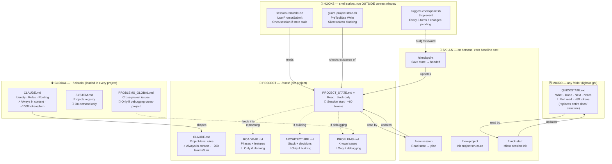

# Dupla-Workflow — System Map

How the system works, what each document does, and where tokens go.

---

## Document Layers



---

## Token Cost — What Gets Loaded When

| Document | When loaded | Tokens/turn | Skippable? |
|---|---|---|---|
| `~/.claude/CLAUDE.md` | **Always** — every session, every project | ~1000 | No — loaded by Claude Code |
| `./CLAUDE.md` | **Always** — if file exists in project | ~200 | No — loaded by Claude Code |
| `PROJECT_STATE.md` `<session>` | Session start (via `/new-session`) | ~60 | Yes — only the `<session>` block |
| `ROADMAP.md` | Only if planning next features | ~300-800 | Yes |
| `ARCHITECTURE.md` | Only if building / designing | ~400-1000 | Yes |
| `PROBLEMS.md` | Only if debugging | ~200-500 | Yes |
| Skills (`*.md`) | Only when `/skill-name` is invoked | 0 baseline | Yes — on-demand |
| `code-review-graph.json` | Generated at init; updated on phase advance | 0 baseline | Yes — reference for audits |
| `QUICKSTATE.md` | Micro sessions only (full read) | ~80 | Yes — replaces all docs |

**Without this system:** An LLM typically reads 3-5 docs per session = 2000-5000 tokens just to understand context.
**With this system:** Session start costs ~1260 tokens (CLAUDE.md global + project + session block).

---

## Can a New LLM Understand the Full Project from One File?

**Currently: partially.** The `<session>` block covers *what to do now* in ~60 tokens. For full architectural context a new LLM also needs `ARCHITECTURE.md`.

**Practical answer for handoffs (Claude → Gemini or new chat):**

```
1. Run /checkpoint → updates PROJECT_STATE.md
2. Tell next LLM: "Read docs/PROJECT_STATE.md first, then ARCHITECTURE.md if needed"
3. That's ~120-300 tokens total — sufficient for 90% of tasks
```

For deep architectural questions the LLM still needs `ARCHITECTURE.md`. The system doesn't eliminate that — it makes it conditional instead of constant.

---

## The Session Loop

```
/new-session                         /checkpoint
     │                                    │
     ▼                                    ▼
Read <session> (~60t)          Write <session> (update)
     │                                    │
     ▼                                    ▼
Conditional loads             Commit → push → handoff
(plan/build/debug only)
     │
     ▼
   WORK
(skills on-demand,
 hooks outside context)
```

---

## Micro Mode (QUICKSTATE)

For small projects or casual sessions — no `docs/` folder needed.

```
/quick-start                    /quick-start (existing)
      │                               │
      ▼                               ▼
  2 questions                  Read QUICKSTATE.md
  Creates QUICKSTATE.md        Show 5-line session
      │                               │
      ▼                               ▼
   WORK                           WORK
      │                               │
      ▼                               ▼
  /quick-start save          Update QUICKSTATE.md
```

Replaces `docs/PROJECT_STATE.md + ROADMAP.md + ARCHITECTURE.md` with one ~80-token file. Suitable for: scripts, experiments, research, non-code tasks, learning sessions.

---

## Code-Review Graph Lifecycle (docs/code-review-graph.json)

Structural fingerprint of the project. Zero token cost at session start — only loaded on demand.

```
/new-project or /adapt-project          /checkpoint (phase advance)
           │                                       │
           ▼                                       ▼
Generate code-review-graph.json       Update code-review-graph.json
 - project folders + file counts       - Set "phase" to current phase
 - risk zones (auth, DB, config)       - Update "lastCommit"
 - doc dependencies                    - Re-scan structure
 - "phase": "Phase 1"                  - Update risk zones if needed
           │                                       │
           ▼                                       ▼
  docs/code-review-graph.json      docs/code-review-graph.json (updated)
```

**When it's generated:** At project initialization (`/new-project`, `/adapt-project`).
**When it's updated:** When `/checkpoint` marks a ROADMAP Outcome as `[x]` (phase advances).
**When it's read:** On demand — for impact analysis, audits, or refactoring planning. Not loaded in normal sessions.
