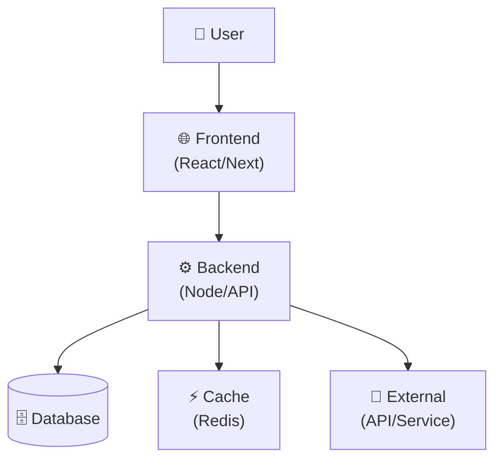

# Architecture — [PROJECT_NAME]

## Overview

[2–3 sentences: what the system does, core components, deployment model]

---

## System Diagram



---

## Core Modules

### Frontend
- **Framework:** [React / Vue / Next.js]
- **State:** [Context / Redux / Zustand]
- **Key features:** [list]

### Backend
- **Runtime:** [Node.js / Python / Go]
- **Framework:** [Express / FastAPI / Gin]
- **Key endpoints:** [list main routes]

### Database
- **Type:** [SQL/NoSQL]
- **Provider:** [PostgreSQL / MongoDB / Firestore]
- **Key tables:** [names + relationships]

### External Services
- [Service name] — [purpose]
- [Service name] — [purpose]

---

## Data Model

[Simple ASCII or Mermaid diagram of core entities]

```
User
├── id
├── email
├── created_at
└── [other fields]

Project
├── id
├── user_id (FK)
├── name
└── [other fields]
```

---

## Deployment

- **Hosting:** [Vercel / VPS / AWS]
- **Database:** [Managed / Self-hosted]
- **CI/CD:** [GitHub Actions / GitLab CI]
- **Monitoring:** [Datadog / New Relic / none]

---

## Technical Decisions

| Decision | Chosen | Alternative | Reason |
|----------|--------|-------------|--------|
| [Framework] | [Choice] | [Other] | [Why this choice] |
| [DB type] | [Choice] | [Other] | [Why this choice] |
| [Auth] | [Choice] | [Other] | [Why this choice] |

---

## Known Tradeoffs

- **[Tradeoff 1]:** We chose [X] over [Y] because [reason]. Cost: [what we gave up].
- **[Tradeoff 2]:** [similar format]

---

## Areas Marked for Review

- [ ] [Component/decision that needs verification as code evolves]
- [ ] [Inferred from project structure, needs team validation]

---

## References

→ Project state: docs/PROJECT_STATE.md
→ Roadmap & phases: docs/ROADMAP.md
→ Implementation status: docs/PROJECT_STATE.md (In Progress)
→ Known issues: docs/PROBLEMS.md
→ Project rules: CLAUDE.md
